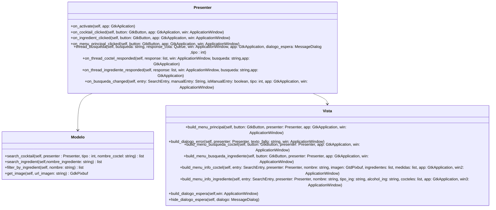
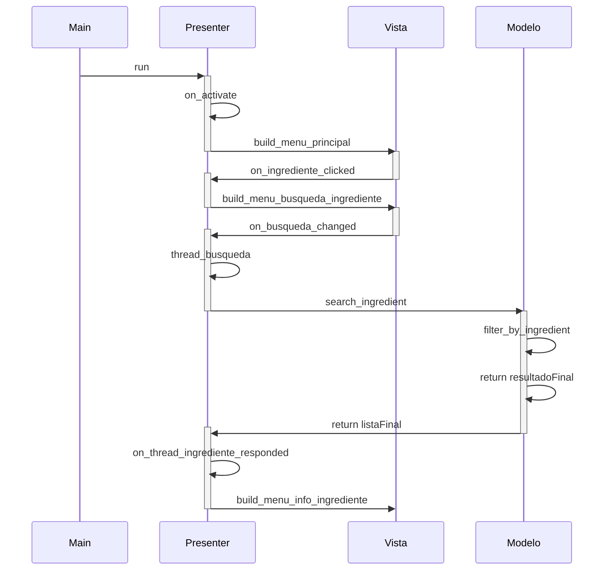
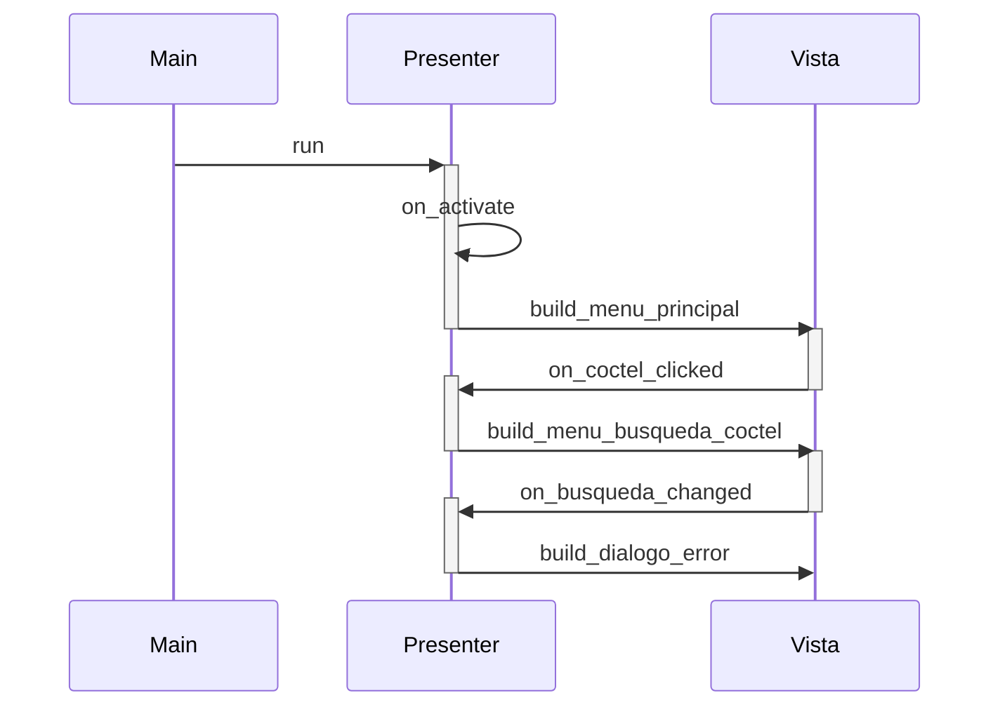
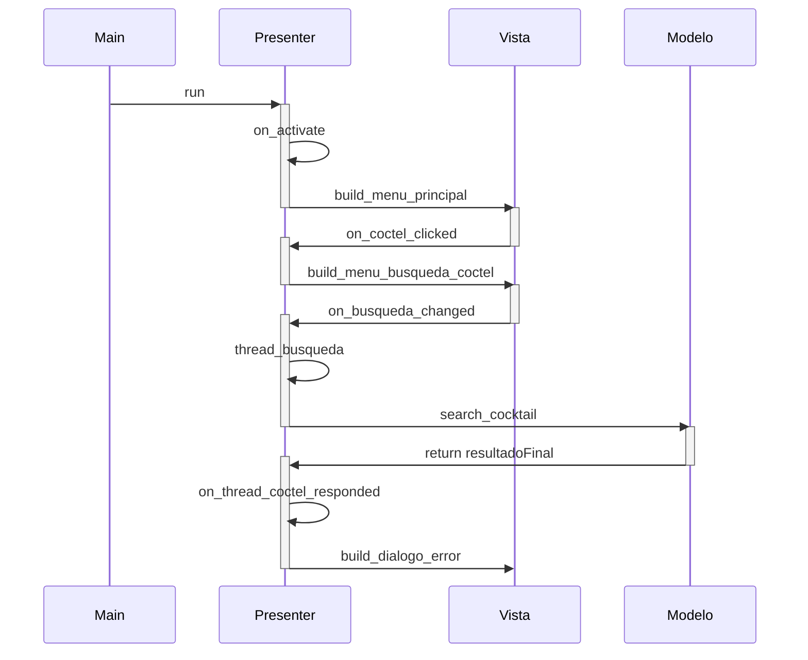

# Diseño software

## Documentación
El diseño sigue el patrón Modelo-Presentador-Vista; el Modelo es el encargado de realizar las operaciones sobre la base de datos (búsquedas),
la Vista se encarga de todo lo relacionado con la parte visual de la interfaz, y el Presentador trabaja como intermediario entre estas dos clases.

## Diagrama estático

## Diagrama dinámico
### Buscar un cóctel

### Buscar un ingrediente

### Buscar un cóctel (Error - Búsqueda vacia)

### Buscar un cóctel (Error - Fallo en la búsqueda / Error - Fallo de conexión)

