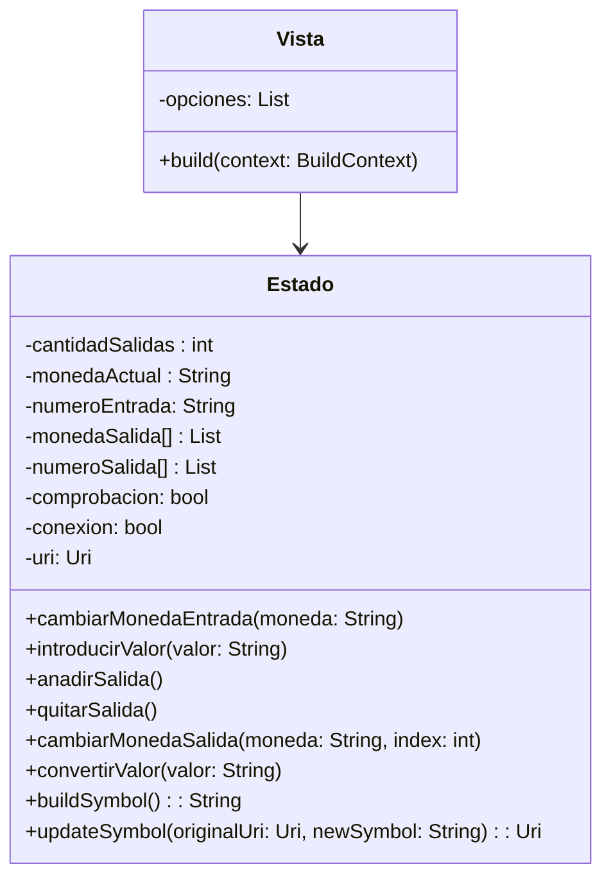
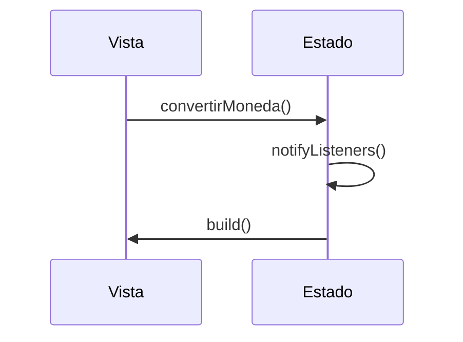

# Diseño software

## Documentación

El diseño sigue el patrón vista-estado (patrón observador), la vista está formada por los diferentes widgets
los cuales son observadores del estado, que los notifica cuando se produce un cambio

## Diagrama estático

### Funcion build()

Dentro del build creariamos toda la interfaz:
Tenemos un if para cada una nde las 2 orientaciones, en el que se devuelve un Scaffold con todos los widgets dentro.
Entre estos widgets habría: TextStyle, DropdownButton, Text, ElevatedButton y IconButton, así como los distintos tipos de contenedores (Row, Column, Container...) para poder organizarlos.

## Diagrama dinámico

El flujo general del programa será este, variando los métodos del estado a los que se llama

El método convertirMoneda() se llamaría al pulsar uno de los botones de la Vista.
Una vez cambiado el Estado, este notificaría a la Vista.

Los demás casos de uso (Añadir/quitar/cambiar monedas de salida, cambiar moneda de entrada) seguirían la misma estructura; simplemente sería otro widget el que los llamaría.

### Caso de error (Misma salida que entrada / Conexión)

La estructura es la misma. Lo que cambiaría es que en caso de detectarse el error correspondiente, el widget de la vista encargado del error 
se haría visible y procedería a mostrar un texto descriptivo del error en cuestión.
